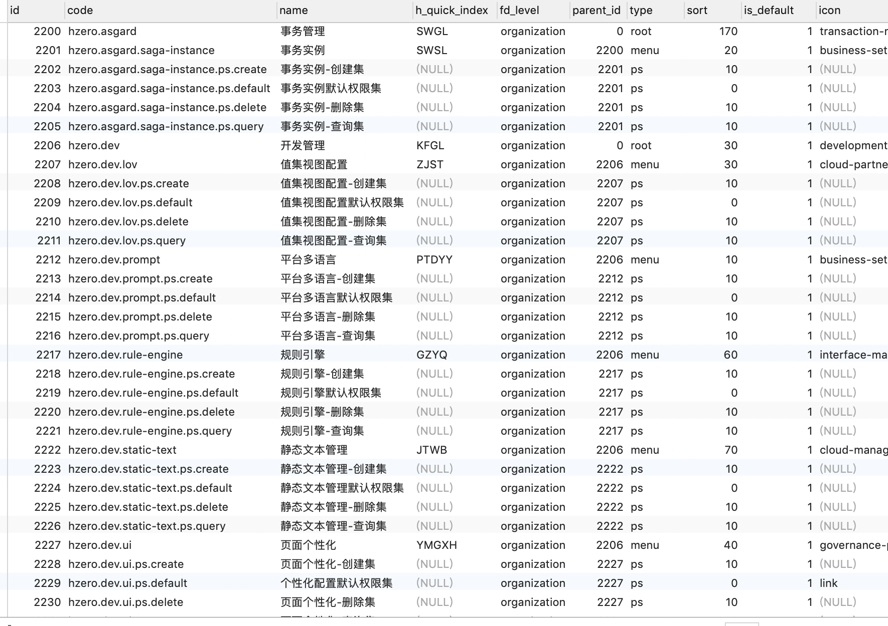

# IAM服务
权限管理服务，平台统一的权限体系架构

## 主要功能
- 角色管理
- 菜单管理
- 帐户管理
- 用户组管理
- 租户管理
- 权限刷新
- 单据权限管理

### 角色管理
角色主要作为权限控制，控制用户可以访问那些资源，包括可见的菜单、可调用的接口、以及我们自己业务服务基于角色做的控制。
1. 初始化角色，通过Excel初始化到数据库中，作为期初数据。新创建租户将基于模版角色创建租户对应角色，并将模版角色对应权限分配给对应继承角色

2. 可将权限集分配给角色（iam_role_permission），权限集属于菜单，菜单对应接口都挂在权限集下，将权限集分配给角色，角色将可看对应菜单，并可访问权限集中对应接口。同时角色可分配给用户（iam_member_role），用户登陆时将可访问其拥有角色权限的资源。

### 菜单管理
菜单管理主要用来控制菜单目录结构、菜单显示、菜单接口权限维护，可将菜单分配给角色。拥有相应菜单权限的角色可查看菜单。
1. 菜单通过Excel维护，主要包括菜单表（iam_menu）、菜单权限表（iam_menu_permission）

2. 菜单表（iam_menu）记录菜单信息，包括目录结构。type指定菜单类型，包括root（根菜单）、dir（目录）、menu（菜单）、ps（权限集），根菜单下可以直接挂目录、菜单，目录下可以挂菜单，菜单下需要有权限集。菜单层次关系通过parent_id标识。route路由为前端页面路由路径。菜单分为平台级、租户级，平台级菜单只能访问平台级接口，租户级菜单只能访问租户级接口。

3. 菜单权限表（iam_menu_permission），权限集作为菜单的子级，主要用来为菜单挂需要访问的接口，一个菜单下权限集可以定义多个。可以在菜单权限表（iam_menu_permission）中将我们开发的接口挂到对应的权限集下

### 权限刷新
IAM 服务有一个重要的功能是刷新服务权限，正常情况下，其它服务启动成功并注册到注册中心后，IAM 监听到服务注册后，会自动获取服务的文档信息，并解析权限更新到 iam_permission。在一些非正常情况下，需要手动调用接口刷新服务权限：
1. 在新部署环境或升级服务完成后，由于有些数据不是从界面维护，导致某些字段不能自动生成，需调用IAM服务的初始化接口进行一些初始化操作。

2. 权限刷新接口

[POST /v1/permission/cache/{serviceName}]

传入服务名，缓存服务权限，此操作会删除缓存中旧的权限，重新刷新。权限缓存到网关服务所在的 Redis database 下，网关默认 redis.database=4，如果修改了此配置，确保在IAM服务中加入 `hzero.service.gateway.redis-db=xx。服务报错 PERMISSION_MISSMATCH 错误时，可先检查 Redis 缓存中是否存在访问的API，如果没有可调用此接口手动缓存服务权限。

[POST /v1/permission/fresh/{serviceName}]

刷新 iam_permission 权限表中的数据。如果 iam_permission 中不存在访问的API时，可调用此接口手动刷新服务权限。该接口会自动更新缓存。此接口有两个参数：serviceName 为服务名；metaVersion 为 swagger 列表中的 version。version 等于服务配置中的 eureka.instance.metadata-map.VERSION。

### 单据权限管理
单据权限是为控制用户查看数据权限范围做的功能，开发人员可通过界面配置维护用户可查看的数据范围。用户登陆系统切换角色，当用户查询数据时在构造mybatis查询语句时，将根据当前用户所用角色，查找角色配置的单据权限对应的权限维度，查看用户在子账户对应维度分配给用户的数据，如果没有分配取角色对应维度分配的对应维度数据，去过滤用户的查询结果集
1. 单据类型表（hiam_doc_type）记录单据类型

2. 单据类型维度表（hiam_doc_type_auth_dim）维护单据类型对应维度

3. 单据类型分配表（hiam_doc_type_assign）维护单据类型可见范围，可指定平台所有租户可见，也可指定具体几个租户可见

4. 角色权限表（hiam_role_authority），当auth_scope_code为BIZ时表示分配单据权限

5. 角色权限行表（hiam_role_authority_line）

6. 角色权限数据表（hiam_role_auth_data）记录分配给角色权限维度

6. 角色权限数据行表（hiam_role_auth_data_line）记录对应权限维度分配数据

